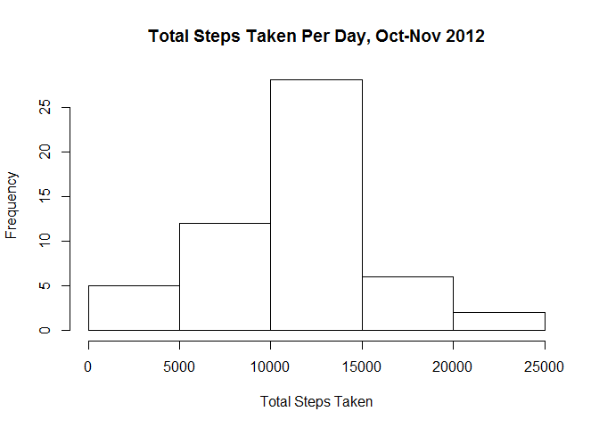
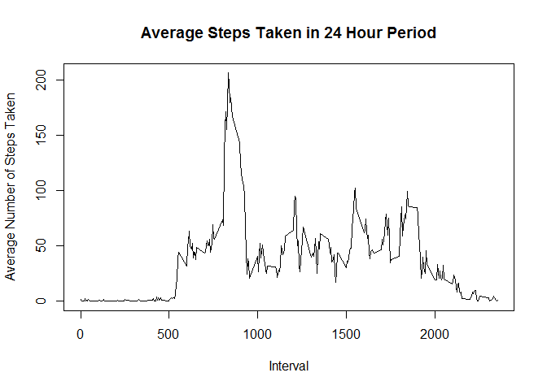
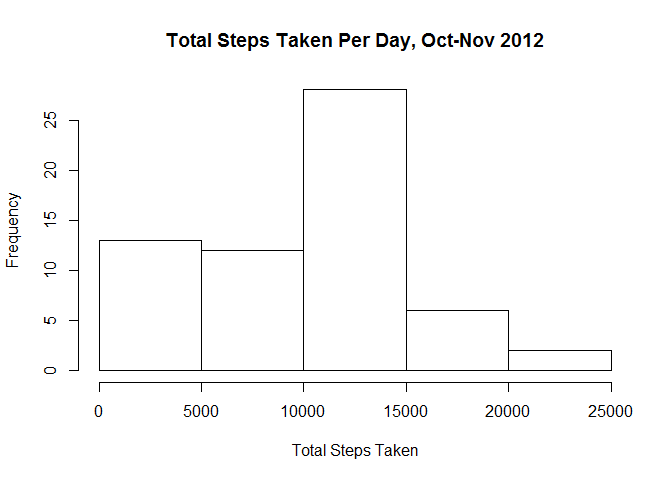
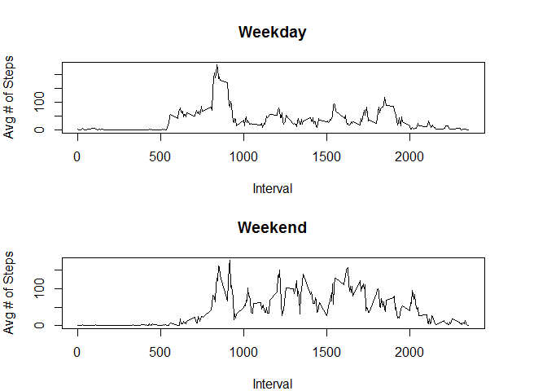

## Loading and preprocessing the data

The following code checks whether the directory has been created, and if not, creates said directory and downloads data: 


```r
if (!file.exists("JS_CP1_Data")){
  dir.create("JS_CP1_Data") # Creates a directory for the final project data if it does not currently exist
}
  setwd("./JS_CP1_Data") # Sets the working directory to the "Final Project Data" directory that was created

  dataURL <- "https://d396qusza40orc.cloudfront.net/repdata%2Fdata%2Factivity.zip"

  download.file(dataURL, "CP1.zip")           

  unzip("CP1.zip")                            

  repdata <- read.csv("activity.csv")
```

## What is mean total number of steps taken per day?

Per the instructions for this setp in the assignment, a histogram of the total number of steps taken each day was requested:


```r
plot <- barplot(tapply(repdata$steps,repdata$date,sum),xlab="Date",ylab="Total Steps Taken",
                main="Total Steps Taken Per Day, Oct-Nov 2012")
```

<!-- -->

Additionally, calculations were performed to determine the mean and median total number of steps taken per day. To
accomplish this, a datset was created that calculated the total number of steps taken each day:  


```r
totsteps <- aggregate(repdata$steps~repdata$date,FUN=sum,na.rm=TRUE)
colnames(totsteps) <- c("date","tot_steps")
```

From here, the mean and median of this dataset were calculated as follows:


```r
average_steps <- round(mean(totsteps$tot_steps),digits=0)  
median_steps <- round(median(totsteps$tot_steps),digits=0)
```

Mean Total Steps Taken Per Day: 1.0766\times 10^{4}

Median Total Steps Taken Per Day: 1.0765\times 10^{4}

## What is the average daily activity pattern?

To determine the average daily activity pattern, a new dataset was generated with the average steps taken at each 5 minute interval:


```r
avgint <- aggregate(repdata$steps~repdata$interval,FUN=mean,na.rm=TRUE) 
colnames(avgint) <- c("interval","avg_steps")
```

From there, a plot was generated to show this average over a 24-hour period:


```r
with(avgint,plot(x=interval,avg_steps,type="l",xlab="Interval",ylab="Average Number of Steps Taken",main="Average Steps Taken in 24 Hour Period"))
```

<!-- -->

Based on this information, the highest average step value was calculated:


```r
max_avg_steps <- avgint$interval[which.max(avgint$avg_steps)]
```

The interval with the highest average steps was 835, which corresponds to 8:35AM.

## Imputing missing values

Before missing values can be imputed, it is important to enumerate all of the observations where a value is missing:

```r
missing_steps <- sum(is.na(repdata$steps))
```

Based on this, it was determined that 2304 observations were missing data on steps taken. Fortunately, since we have averages for each 5-minute interval over a period of two months (as seen in the table named "avgint"), we can impute the average for those missing values, where applicable. Therefore, a new dataset was created to incorporate these imputed data:


```r
imputed_steps <- repdata
imputed_steps$steps <- ifelse(is.na(imputed_steps$steps), avgint$avg_steps[imputed_steps$interval], imputed_steps$steps)
```

Using this new dataset, a new histogram was generated using the following code:


```r
plot <- barplot(tapply(imputed_steps$steps,imputed_steps$date,sum),xlab="Date",ylab="Total Steps Taken",
                main="Total Steps Taken Per Day, Oct-Nov 2012")
```

<!-- -->

Additionally, the mean and median total steps were re-calculated using the following code:


```r
i_totsteps <- aggregate(imputed_steps$steps~imputed_steps$date,FUN=sum,na.rm=TRUE)
colnames(i_totsteps) <- c("date","tot_steps")

i_mean <- round(mean(i_totsteps$tot_steps),digits=0)  
i_median <- round(median(i_totsteps$tot_steps),digits=0)  
```

Mean Total Steps Taken Per Day: 9546

Median Total Steps Taken Per Day: 1.0395\times 10^{4}

Based on the numbers presented, it appears as though imputing missing values drives the mean and median steps down (compared to the original data), suggesting that missing data artificially inflated the mean and median total daily steps taken.

## Are there differences in activity patterns between weekdays and weekends?

Finally, this assignment sought to assess the differences that existed in activity patterns between weekdays and weekends. To that end, a variable was created for the imputed dataset that determined whether a day was a weekday or a weekend:


```r
imputed_steps$day_type <- ifelse(weekdays(as.POSIXct(imputed_steps$date)) == "Saturday" | 
                                   weekdays(as.POSIXct(imputed_steps$date)) == "Sunday", "Weekend", "Weekday")
```

Using this new variable, it was possible to develop a dataset that would assess the average number of steps taken at each interval, stratified by weekdays and weekends. The following code generates the dataset and subsequent graphs for analysis:

```r
i_avgint <- aggregate(imputed_steps$steps~imputed_steps$interval+imputed_steps$day_type,FUN=mean,na.rm=TRUE) 
colnames(i_avgint) <- c("interval","day_type","avg_steps")

par(mfrow=c(2,1), mar=c(4,4,4,4))
invisible(by(i_avgint,i_avgint$day_type,FUN=function(x){
  plot(x=x$interval,y=x$avg_steps,type="l",xlab="Interval",ylab="Avg # of Steps",main=x$day_type[1])
}))
```

<!-- -->

Based on the data in the graphs, it appears as though weekend activity was higher than weekday activity.
